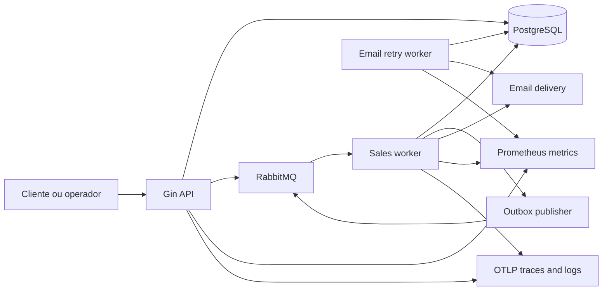
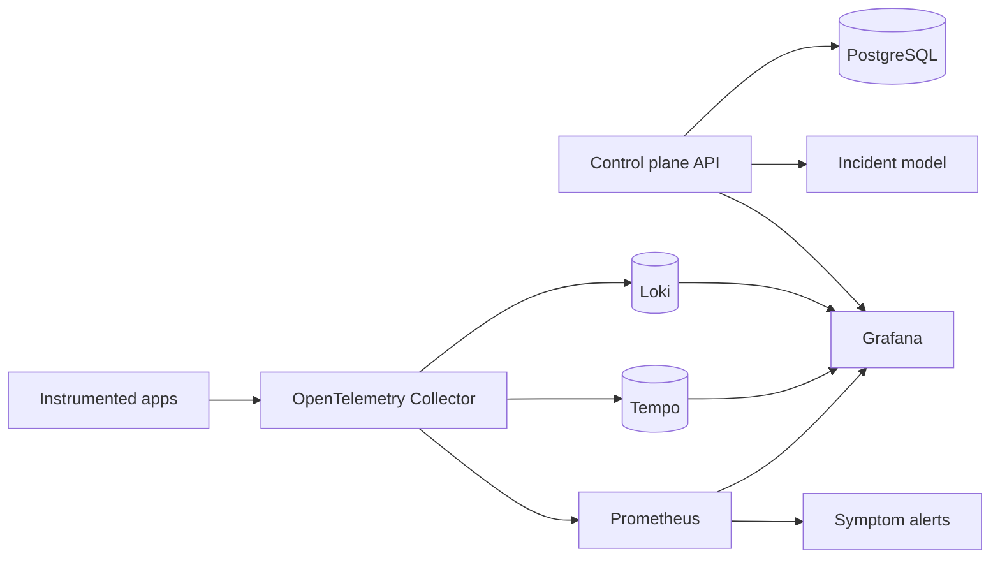
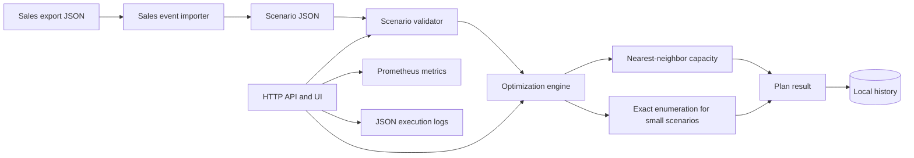
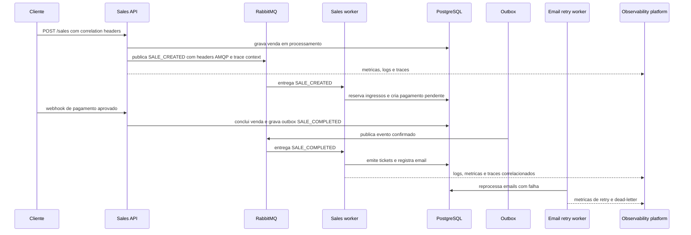
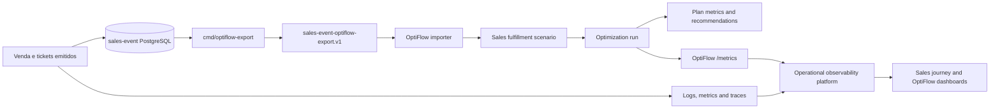
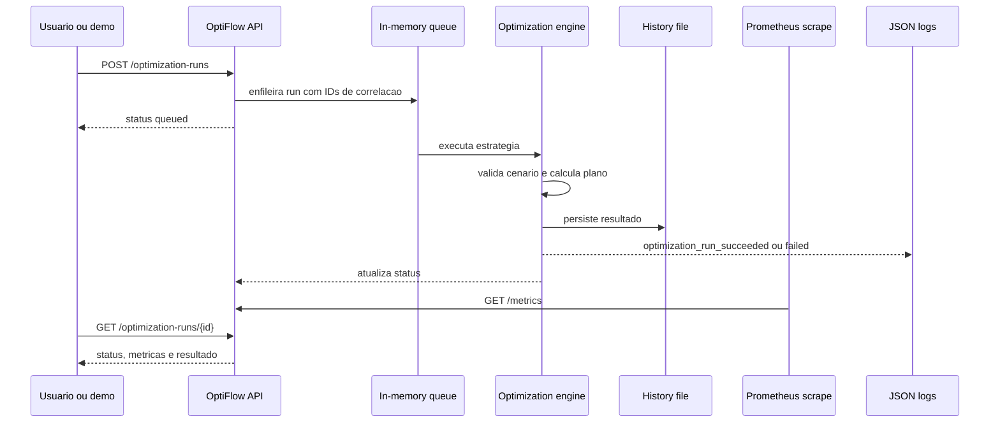

# Diagramas Finais do Portfolio

Estes diagramas explicam as responsabilidades dos tres projetos sem exigir a
leitura do codigo. Eles usam Mermaid para permanecerem versionaveis em Markdown.

## Arquitetura por Projeto

### sales-event-project

Responsabilidade: processar a venda de ponta a ponta com fila, outbox, retry,
ticket, email, check-in e sinais de operacao.

### operational-observability-platform

Responsabilidade: receber sinais, correlacionar logs/metricas/traces, expor
dashboards, SLOs, alertas e investigacao operacional.

### OptiFlow

Responsabilidade: transformar cenarios operacionais em planos comparaveis,
com metricas de custo, distancia, atraso, demanda nao atendida e risco.

## Jornada de Venda Observavel

Leitura esperada: uma unica jornada pode ser investigada por `correlation_id`,
`transaction_id`, `trace_id` e labels de servico.

## Dados entre Venda, Observabilidade e Otimizacao

Leitura esperada: dados historicos de venda alimentam um cenario de decisao, e
os sinais de execucao permitem observar tanto o negocio quanto a otimizacao.

## Fluxo de Execucao do OptiFlow

Leitura esperada: cada execucao possui IDs rastreaveis, resultado persistido,
logs estruturados e metricas Prometheus de baixa cardinalidade.

